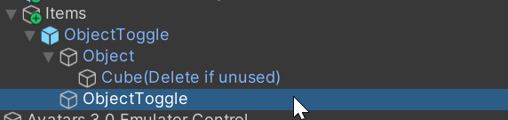

# Simple Object Toggle

简单的物体开关和固定于世界的物体，该预制件依赖 Modular Avatar。默认 [Write Defaults OFF](https://creators.vrchat.com/avatars/#write-defaults-on-states)。制作过程参考 [Toggle an object | Modular Avatar](https://modular-avatar.nadena.dev/docs/tutorials/object_toggle)

## ObjectToggle 使用

预制件位置：Assets/crazt/MA/attachs/ObjectToggle/ObjectToggle.prefab

1. 将需要被开关的物体放置在 ObjectToggle 预制件 Object 的内部, 这里的 Cube 为示例，建议放置后删去.

    

2. 选择 Object 需要绑定的位置或骨骼

    

    

3. 选择菜单安装位置，同时可以根据加入的物体修改菜单名称

    

    

4. 如需增加多个物体，只需要重复增加预制件
    

    

## ObjectWorldFix

预制件位置：Assets/crazt/MA/attachs/ObjectWorldFix/ObjectWorldFix.prefab

使用方法与上述 ObjectToggle 基本相同，区别为骨骼绑定使用父约束
